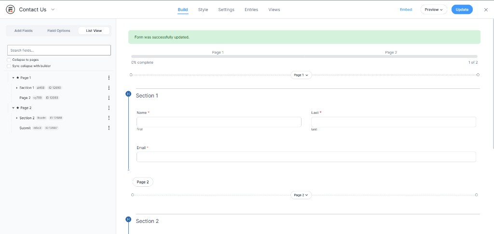
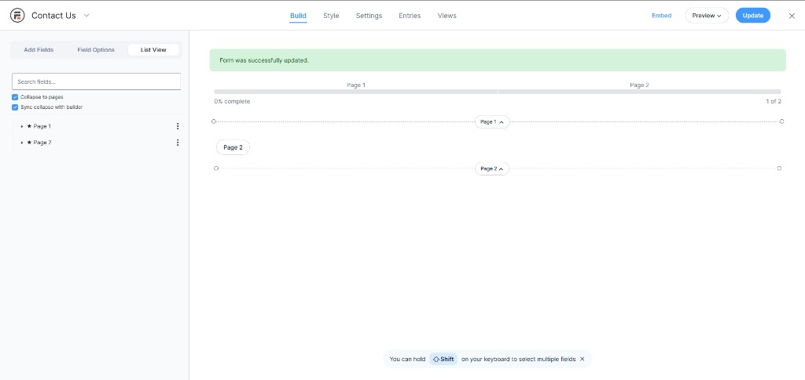

# Formidable List View

**Hierarchical List View tab for the [Formidable Forms](https://formidableforms.com/) builder** — search, collapse pages, drag reorder, and inline edit. Built for large multi-page forms where the canvas is hard to navigate.

**Requires Formidable Forms 6.31+** · WordPress 6.0+ · PHP 7.4+

[](https://github.com/Anush-Prabhu/Formidable-List-View-WP-Plugin/releases/latest)
[](LICENSE)
[](https://formidableforms.com/)

> **Not affiliated with Strategy11 or Formidable Forms.** Community plugin using official Formidable builder hooks.

**[Download latest release](https://github.com/Anush-Prabhu/Formidable-List-View-WP-Plugin/releases/latest)** · [Changelog](CHANGELOG.md) · [License](LICENSE) · [Report an issue](https://github.com/Anush-Prabhu/Formidable-List-View-WP-Plugin/issues)

---

## Screenshots

**Full tree** — pages, sections, and fields with keys and IDs:



**Collapse to pages** — overview of a multi-page form at a glance:



---

## Why Formidable power users need this

If you manage forms with **many pages and hundreds of fields**, the visual builder alone is slow:

- Scrolling the canvas to find one field wastes time
- Page structure is spread across rootline + canvas, not one outline
- Row actions on the canvas are easy to miss on long forms

List View adds a **builder sidebar tab** that mirrors your form hierarchy. It uses Formidable’s extension hooks (`frm_extra_form_instruction_tabs`, `frm_extra_form_instruction_tabs_content`) — not private APIs.

| You get | Benefit |
|---------|---------|
| ★ Page rows | See every page break in one list (stars in List View only) |
| Search | Filter by label, field key, or ID |
| Collapse to pages | Work at page level, then drill in |
| Drag reorder | Move fields in the list; canvas order updates |
| ⋮ row menu | Delete, Duplicate, Field Settings without jumping to options |

---

## Quick install

### Option A — Download zip (recommended)

1. Open **[Releases](https://github.com/Anush-Prabhu/Formidable-List-View-WP-Plugin/releases/latest)** and download the latest zip, or install from [WordPress.org](https://wordpress.org/plugins/formidable-list-view/) once approved.
2. In WordPress: **Plugins → Add New → Upload Plugin** → choose the zip → **Install Now** → **Activate**.

### Option B — Git clone

```bash
git clone https://github.com/Anush-Prabhu/Formidable-List-View-WP-Plugin.git wp-content/plugins/formidable-list-view
```

Then activate **Formidable List View** under **Plugins**.

---

## Requirements

| Requirement | Version |
|-------------|---------|
| WordPress | 6.0+ |
| PHP | 7.4+ |
| [Formidable Forms](https://formidableforms.com/) | **6.31+** |
| Formidable Pro | Recommended (page breaks, sections, repeaters) |

The plugin loads only on the form **Build** screen for users who can edit forms. It does not run on the front end.

---

## Getting started

1. Open **Formidable → Forms** and edit any form.
2. Click the **List View** tab in the left sidebar (next to Add Fields and Field Options).
3. Click a row to select that field on the canvas and open inline controls.

### Toolbar

| Control | What it does |
|---------|----------------|
| **Search fields…** | Filters the tree by label, field key, field ID, or type. |
| **Collapse to pages** | Shows only ★ Page 1, ★ Page 2, … Expand a page to see contents. |
| **Sync collapse with builder** | Collapsing/expanding a page in List View also toggles that page on the canvas rootline. |

### Tree rows

- **Drag handle** (≡) — reorder within the same page or section
- **Chevron** — expand/collapse sections, repeaters, pages
- **Field icon**, **label**, **field key**, **ID**
- **⋮ menu** — Delete, Duplicate, Field Settings (menu opens without auto-selecting the field)

### Inline editing

Select a field to edit **Label** and **Visible** (where Formidable supports it) under the row.

### Drag to reorder

Drag by the handle; canvas order and `field_order_*` inputs update so order persists on **Update**.

---

## How the tree is built

Fields come from `FrmField::get_all_for_form()`:

- **Multi-page forms** — synthetic **Page** nodes at the top; children follow builder order.
- **Single-page forms** — nested tree of sections and fields.
- **Page titles** — rootline titles, page break name, or “Page N”, with ★ prefix in List View only.

After add/delete/duplicate, save the form or return to the List View tab to refresh the tree.

---

## REST API

```http
GET /wp-json/frm-list-view/v1/form/{form_id}/tree
```

Header: `X-WP-Nonce: {wp_rest nonce}`

---

## Security

- Builder-only load for users with `frm_edit_forms`
- REST permission checks
- Safe JSON in `data-tree` (`JSON_HEX_*`)
- Icon class allowlist
- Directory `index.php` stubs

---

## File structure

```text
formidable-list-view/
├── formidable-list-view.php
├── LICENSE
├── README.md
├── CHANGELOG.md
├── includes/
│   ├── class-flv-plugin.php
│   ├── class-flv-tree-builder.php
│   └── class-flv-rest.php
├── views/list-view-panel.php
├── assets/js/list-view.js
├── assets/css/list-view.css
└── docs/screenshots/
```

---

## Upstream feature idea

Think List View should be **built into Formidable core**? Read [`.github/upstream-feature-request.md`](.github/upstream-feature-request.md) — this repo is a reference implementation. Open an [issue](https://github.com/Anush-Prabhu/Formidable-List-View-WP-Plugin/issues/new/choose) or [Discussion](https://github.com/Anush-Prabhu/Formidable-List-View-WP-Plugin/discussions) with feedback.

---

## Changelog

See [CHANGELOG.md](CHANGELOG.md).

---

## License

Released under the [GNU General Public License v2 or later](LICENSE). You are free to use, modify, and distribute this plugin under the GPL terms.
